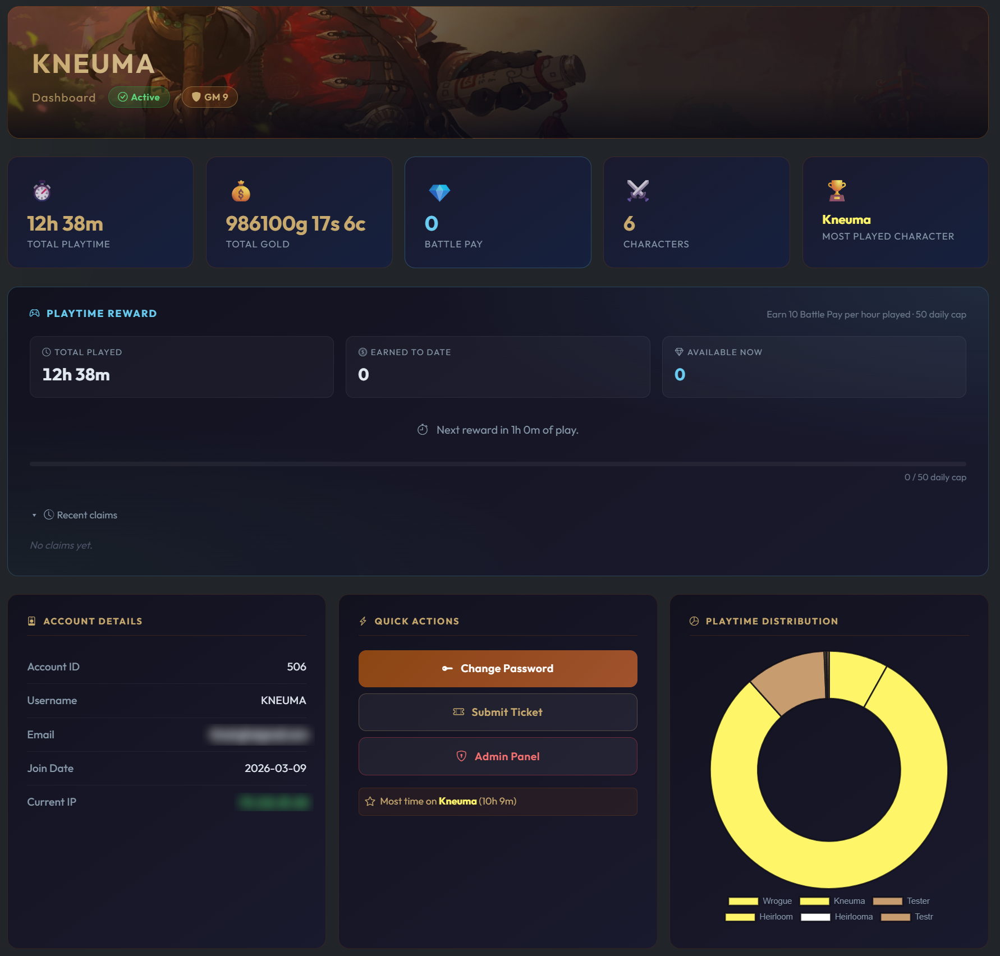
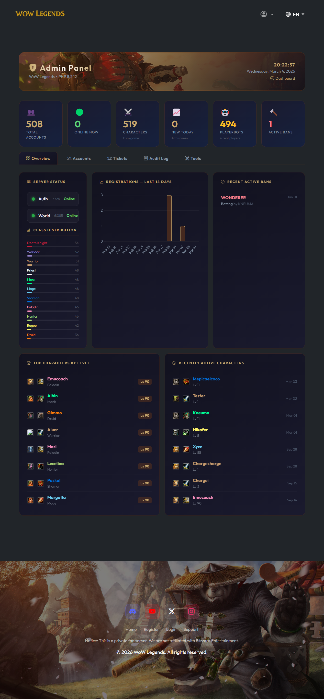
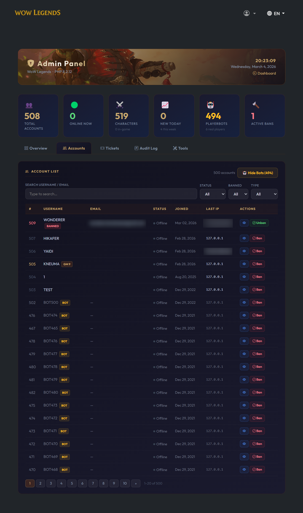
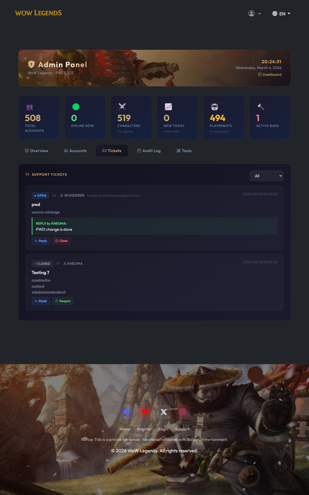

# WoW Mists of Pandaria Registration Portal

A complete, secure, and modern registration portal for **World of Warcraft: Mists of Pandaria (5.4.8)** private servers. Built for TrinityCore-based cores (including repacks).

  

## Table of Contents

- [Features](#features)
- [Preview](#preview)
  - [Home Page](#home-page)
  - [User Dashboard](#user-dashboard)
  - [Admin Dashboard - Overview](#admin-dashboard---overview)
  - [Admin Dashboard - Accounts](#admin-dashboard---accounts)
  - [Admin Dashboard - Tickets](#admin-dashboard---tickets)
- [Quick Start](#quick-start)
- [Requirements](#requirements)
  - [Recommended: XAMPP](#recommended-xampp)
  - [PHP Extensions](#php-extensions)
- [Installation](#installation)
  - [1. Download](#1-download)
  - [2. Configure](#2-configure)
  - [3. Database Setup](#3-database-setup)
  - [4. Feature Flags](#4-feature-flags)
  - [5. Social Links & Content](#5-social-links--content)
  - [6. Dependencies](#6-dependencies)
  - [7. Enable mod_rewrite](#7-enable-mod_rewrite)
- [Admin Dashboard](#admin-dashboard)
- [Customization](#customization)
  - [Changing Text and Labels](#changing-text-and-labels)
  - [Replacing Images and Logo](#replacing-images-and-logo)
- [Project Structure](#project-structure)
- [Security Notes](#security-notes)
- [Troubleshooting](#troubleshooting)
- [License](#license)

## Features

- 🔒 **Security** — CSRF tokens, Google reCAPTCHA v2, PDO prepared statements, PHP-execution blocking on uploads
- 🛡️ **Rate Limiting** — Automatic lockout after failed login attempts (configurable)
- 🗝️ **Auth** — SHA-1 password hashing matching the TrinityCore format
- 📧 **Email** — SMTP password recovery and ticket notifications via PHPMailer
- 📊 **Live Stats** — Real-time server status, player counts, and animated counters
- 🌍 **Multilingual** — English and Spanish included; easy to add more
- 🎨 **Modern UI** — Dark gaming theme, Bootstrap 5, responsive design
- ⚙️ **Feature Flags** — Toggle tickets, password recovery, reCAPTCHA, and maintenance mode from config
- 🧑‍💼 **Admin Dashboard** — Account management, ban/unban, ticket management, audit log, character lookup, IP bans, email broadcast
- 🎫 **Ticket System** — Database-stored support tickets with admin replies, status tracking, and user history
- 📰 **News & FAQ** — Configurable news section and FAQ accordion on the home page
- 🗳️ **Vote System** — Vote site links on the user dashboard (configurable)
- 🔗 **Social Links** — Discord, YouTube, X (Twitter), Instagram — each individually toggleable

---

## Preview

### Home Page


### User Dashboard


### Admin Dashboard - Overview


### Admin Dashboard - Accounts


### Admin Dashboard - Tickets


---

## Quick Start

```bash
# 1. Install XAMPP — https://www.apachefriends.org/
# 2. Serve this project from your Apache web root or a dedicated VirtualHost/Alias
#    Do not run it from a subfolder such as /wow-legends without remapping DocumentRoot

# 3. Copy the sample config
copy config.sample.php config.php

# 4. Edit config.php with your DB credentials, realm info, site base URL, reCAPTCHA keys, etc.

# 5. Install PHP dependencies
composer install

# 6. Run the SQL setup (see Database Setup section below)

# 7. Start Apache from the XAMPP Control Panel (your repack already runs its own MySQL)

# 8. Visit the URL configured in config.php, for example http://localhost/
```

---

## Requirements

### Recommended: XAMPP

The easiest way to run this project is with [**XAMPP**](https://www.apachefriends.org/), which bundles **Apache** and **PHP** in a single installer. Your repack already provides its own MySQL database, so you only need XAMPP for the web server.

| Requirement | Minimum | Recommended |
|---|---|---|
| **PHP** | 7.4 | 8.0+ |
| **Apache** | with `mod_rewrite` enabled | Included in XAMPP |
| **Composer** | 2.x | Latest stable |

### PHP Extensions

The following extensions must be enabled in `php.ini`. In XAMPP, open `C:\xampp\php\php.ini`, search for each extension, remove the leading `;` to uncomment it, then **restart Apache**.

| Extension | Purpose |
|---|---|
| `pdo_mysql` | Database access |
| `openssl` | SMTP TLS/SSL for emails |
| `mbstring` | String handling |
| `hash` | SHA-1 password hashing *(enabled by default in PHP 8)* |
| `curl` | Recommended for reCAPTCHA and outbound HTTP requests |
| `gmp` | Big number math *(optional, for SRP6)* |
| `fileinfo` | MIME type checking for ticket attachments |

---

## Installation

### 1. Download

Clone the repo or download the ZIP, then serve it from your Apache site root:

```
C:\xampp\htdocs\
```

> [!IMPORTANT]
> This project currently uses root-relative URLs such as `/login`, `/register`, `/assets/...` and `.htaccess` rules that assume the app is mounted at the web root. If you keep the repo in a subfolder like `C:\xampp\htdocs\wow-legends`, configure an Apache `VirtualHost` or `Alias` so that folder is served as its own site root.

### 2. Configure

Copy `config.sample.php` to `config.php`:

```
config.sample.php  →  config.php
```

Open `config.php` and set:

| Setting | Description |
|---|---|
| **Database** | MySQL host, user, password, auth DB name, characters DB name |
| **Realm** | Realmlist address, realm name, expansion ID, server ports |
| **Site** | Site title, base URL |
| **reCAPTCHA** | Site key + secret from [Google reCAPTCHA](https://www.google.com/recaptcha) (v2 Checkbox) |
| **SMTP** | Email host, port, credentials for password recovery and ticket notifications |
| **Client** | External download link for the game client (Mega, MediaFire, etc.) |
| **Social Links** | Discord, YouTube, X (Twitter), Instagram URLs — leave empty to hide |
| **News** | Array of news entries shown on the home page |
| **FAQ** | Array of question/answer pairs for the FAQ accordion |
| **Vote Sites** | Array of vote site links shown on the user dashboard |

> [!TIP]
> **Default DB credentials** for most repacks: `host=127.0.0.1`, `user=root`, `password=ascent`, `name_auth=auth`, `name_chars=characters` — these are already pre-filled in `config.sample.php`.

> [!IMPORTANT]
> Set `site.base_url` to the exact URL where the app is reachable. Password recovery emails build reset links from this value.

### 3. Database Setup

> [!IMPORTANT]
> **The ticket system, admin audit log, and password recovery require extra tables in your `auth` database.** Without these tables, those features will show database errors.

Open **phpMyAdmin** (your repack's DB manager), select the **`auth`** database, go to the **SQL** tab, and run the contents of `sql/setup.sql`:

```sql
-- This creates 3 tables:
-- 1. password_resets  — for password recovery
-- 2. tickets          — for the support ticket system
-- 3. admin_audit_log  — for tracking admin actions

-- Compatible with MySQL 5.5.9+
-- See sql/setup.sql for the full script
```

You can also run it from the command line:

```bash
mysql -u root -pascent auth < sql/setup.sql
```

The script uses `CREATE TABLE IF NOT EXISTS`, so it's safe to run multiple times.

### 4. Feature Flags

The `features` block in `config.php` lets you toggle features without touching code:

```php
'features' => [
    'recaptcha'        => true,   // reCAPTCHA on all forms
    'recover_password' => true,   // Password recovery via email
    'tickets'          => true,   // Support ticket system
    'maintenance'      => false,  // Maintenance mode (GMs can still log in)
],

// Brute-force lockout settings (file-based, no DB table needed)
'security' => [
    'max_login_attempts' => 5,   // Failed attempts before lockout
    'lockout_minutes'    => 15,  // Duration of lockout in minutes
],

// Message shown during maintenance
'maintenance_message' => 'The server is currently under maintenance.',
```

| Flag | When `false` |
|---|---|
| `recaptcha` | reCAPTCHA widget hidden, JS not loaded, server-side check bypassed |
| `recover_password` | `/recover` and `/reset_password` redirect to `/login`; link hidden |
| `tickets` | `/tickets` redirects to `/dashboard`; menu item hidden |
| `maintenance` | All pages show a maintenance screen (GMs with level ≥ 9 are exempt) |

### 5. Social Links & Content

Social links appear in the hero section and footer. Set to empty string `''` to hide any link:

```php
'social' => [
    'discord'   => 'https://discord.gg/your-invite',
    'youtube'   => '',   // hidden when empty
    'twitter'   => '',
    'instagram' => '',
],
```

News entries and FAQ items are also configured in `config.php`:

```php
'news' => [
    ['title' => 'Server Launch!', 'date' => '2026-03-02', 'text' => 'We are live!', 'icon' => 'bi-megaphone'],
],

'faq' => [
    ['q' => 'Is it free to play?', 'a' => 'Yes, 100% free.'],
],

'vote_sites' => [
    ['name' => 'TopG', 'url' => 'https://topg.org/...', 'cooldown_hours' => 12],
],
```

### 6. Dependencies

Run Composer after a normal clone:

```bash
composer install
```

`vendor/` is ignored by Git in this repo, so a fresh clone will not contain PHPMailer until Composer installs it. If you received a packaged copy that already includes `vendor/`, you can skip this step.

### 7. Enable mod_rewrite

Pretty URLs (`/login`, `/register`) require Apache's `mod_rewrite`:

1. Open `C:\xampp\apache\conf\httpd.conf`
2. Find and uncomment: `LoadModule rewrite_module modules/mod_rewrite.so`
3. Find your `<Directory>` block and set `AllowOverride All`
4. Restart Apache

---

## Admin Dashboard

Accessible at `/admin_dashboard` for accounts with GM level ≥ 9.

| Tab | Features |
|---|---|
| **Overview** | Server status, registration chart (14 days), class distribution, recent bans, top characters |
| **Accounts** | Full account list with search/filter, inline Ban/Unban buttons, account detail modal (view chars, reset password, edit email, set GM level) |
| **Tickets** | View all support tickets, filter by status, reply to tickets, close/reopen |
| **Audit Log** | Chronological log of all admin actions (bans, unbans, edits, etc.) |
| **Tools** | Character lookup, IP ban management, server stats, email broadcast to all users |

All admin actions are logged to the `admin_audit_log` table automatically.

---

## Customization

### Changing Text and Labels

All user-facing text is in the `lang/` folder:

```
lang/
├── en.php   ← English
└── es.php   ← Spanish
```

Edit the key-value pairs to change any text on the site:

```php
// lang/en.php
'welcome'    => 'Welcome to WoW Legends',
'index_lead' => 'Join our MoP private server!',
```

**Adding a new language:**
1. Copy `lang/en.php` to e.g. `lang/de.php`
2. Translate all values
3. Add the new option to the language dropdown in `templates/header.php`

### Replacing Images and Logo

All images are stored in `assets/img/`:

| File | Usage |
|---|---|
| `logo.webp` | Large hero logo on the homepage |
| `top-logo.webp` | Small navbar logo |
| Background images | `.webp` format recommended |

---

## Project Structure

```
wow-legends/
├── .htaccess             ← URL rewriting and basic hardening
├── .gitignore
├── assets/
│   ├── css/              ← style.css
│   └── img/              ← logos, backgrounds, race/class icons, screenshots
├── cache/
│   ├── login_history/    ← Per-user login history JSON files
│   └── rate_limit/       ← File-based login throttling data
├── includes/
│   ├── audit.php         ← Admin audit log helper
│   ├── auth.php          ← Password hashing, IP detection
│   ├── csrf.php          ← CSRF token generation/validation
│   ├── db.php            ← Database connections
│   ├── email.php         ← PHPMailer send functions
│   ├── functions.php     ← Backward-compat loader
│   ├── helpers.php       ← WoW helpers (format playtime, gold, race/class names)
│   ├── lang.php          ← Language loader
│   ├── login_history.php ← File-based login history helper
│   ├── rate_limiter.php  ← File-based brute-force protection
│   └── recaptcha.php     ← reCAPTCHA verification (respects feature flag)
├── lang/                 ← Language files (en.php, es.php)
├── pages/
│   ├── admin_api.php     ← AJAX API for admin actions
│   ├── admin_dashboard.php
│   ├── change_password.php
│   ├── dashboard.php
│   ├── login.php
│   ├── logout.php
│   ├── recover.php
│   ├── register.php
│   ├── reset_password.php
│   └── tickets.php
├── sql/
│   └── setup.sql         ← Required tables (tickets, audit log, password resets)
├── templates/            ← header.php and footer.php
├── uploads/
│   ├── .htaccess         ← Blocks PHP execution in uploads
│   └── tickets/          ← Ticket attachments
├── config.php            ← Your config (gitignored)
├── config.sample.php     ← Safe template to commit
├── favicon.ico
└── index.php             ← Homepage / router
```

---

## Security Notes

- `config.php` is in `.gitignore` — **never commit it**
- The `uploads/` folder has a `.htaccess` that blocks PHP execution
- All forms use CSRF tokens
- All DB queries use PDO prepared statements
- Directory listing is disabled via `Options -Indexes`
- Rate limiting protects login from brute-force attacks
- Admin actions are logged to `admin_audit_log` with IP, timestamp, and details

---

## Troubleshooting

| Problem | Solution |
|---|---|
| **Links go to `/login` or `/assets/...` at the wrong location** | The app is being served from a subfolder. Serve it from the web root or map the repo folder to its own Apache VirtualHost/Alias. |
| **404 on `/login`, `/register`** | Enable `mod_rewrite` — see step 7 above |
| **"Database error" on tickets or password recovery** | Run `sql/setup.sql` on your `auth` database — see step 3 |
| **"Invalid default value" when running SQL** | Your MySQL is very old. Use the latest `setup.sql` which is compatible with MySQL 5.5.9+ |
| **reCAPTCHA not showing** | Check your site key/secret in `config.php`, or set `recaptcha => false` |
| **`composer install` fails or `PHPMailer` class is missing** | Install Composer dependencies in the project root. A fresh clone does not include `vendor/`. |
| **Emails not sending** | Verify SMTP credentials; for Gmail use an [App Password](https://support.google.com/accounts/answer/185833) |
| **Blank page / 500 error** | Check `C:\xampp\php\logs\php_error_log` for details |
| **Admin dashboard not loading** | Your account needs GM level ≥ 9 in the `account_access` table, and the route is `/admin_dashboard` |

---

## License

This project is licensed under the [MIT License](LICENSE).
