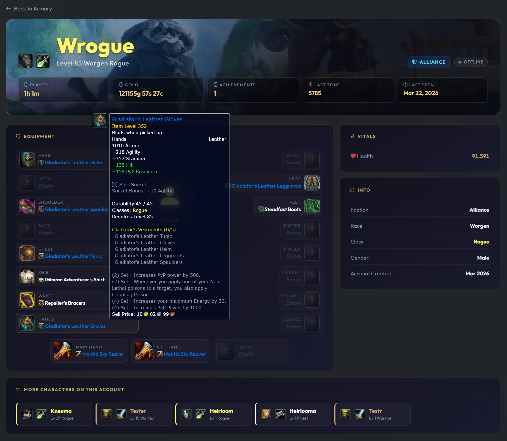
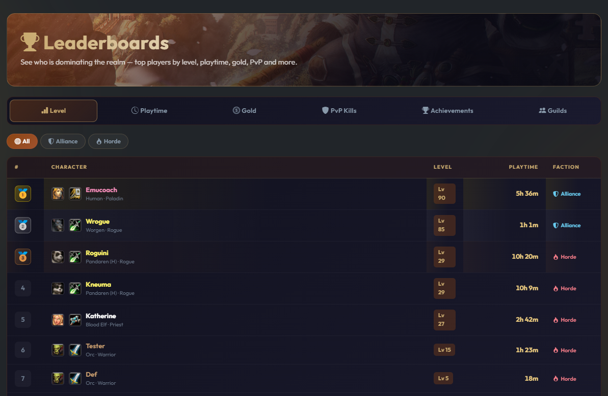
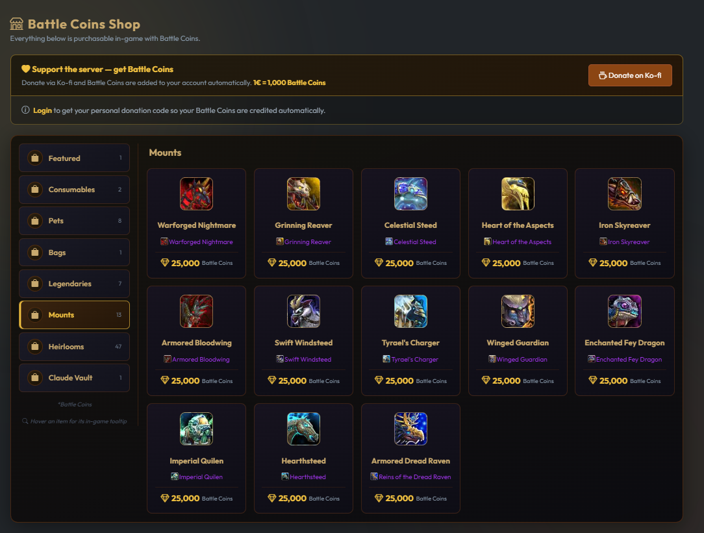
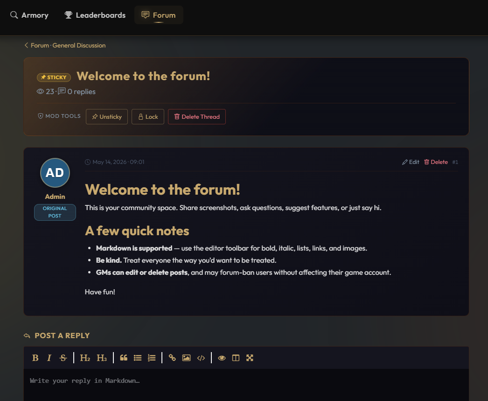
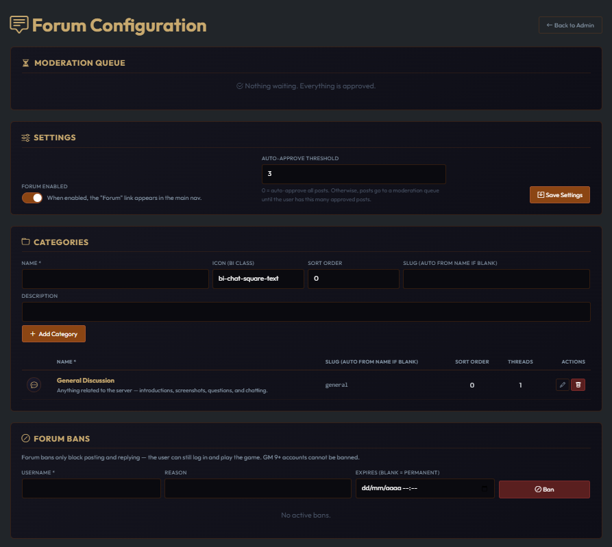
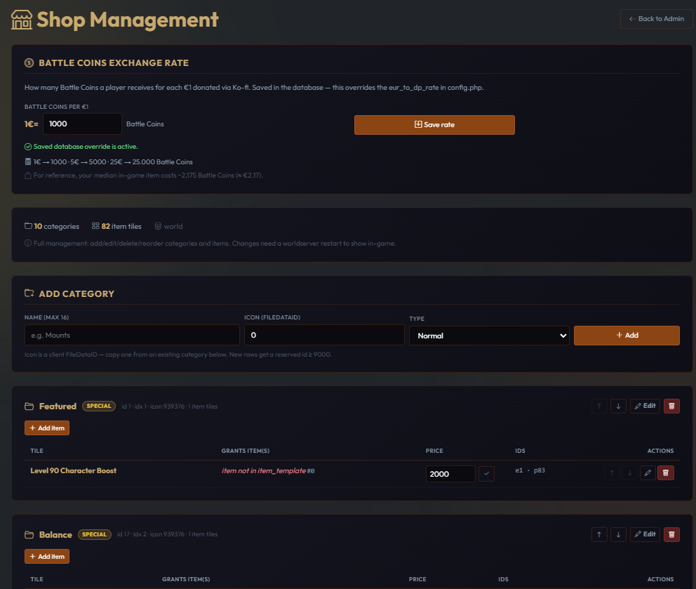
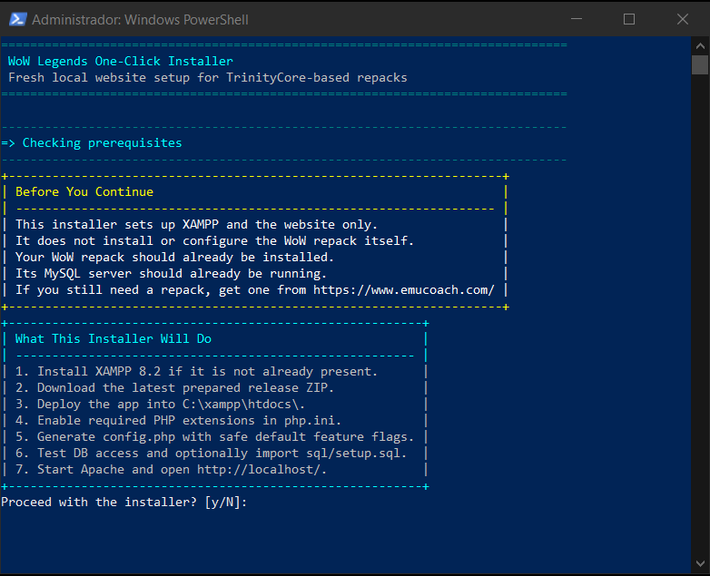

# WoW Mists of Pandaria Registration Portal

A complete, secure, and modern registration portal for **World of Warcraft: Mists of Pandaria (5.4.8)** private servers. Built for TrinityCore-based cores (including repacks).

🌐 **Live demo:** [wow-legends.eu](https://wow-legends.eu/) — every feature you see in this README is running there.

     [](https://wow-legends.eu/)

> ⚠️ **Active Development** — two ways to run it:
> - **Tagged release** *(recommended / production)* — what the [one-click installer & updater](docs/UPDATE.md) install. Stable.
> - **`develop` branch** — finished, tested features that aren't in a release yet. `git clone -b develop …` (or `git pull` on `develop`), then run the idempotent `sql/setup.sql`. See **[What's on `develop`](#whats-on-develop-not-yet-released)** for the current list.

> 💛 **Enjoying the portal?** It's free and open-source, built and maintained in spare time. If it saved you hours of setup or you'd like to see it keep growing, a coffee genuinely helps — see [Support the Project](#support-the-project).
>
> [](https://ko-fi.com/kneuma)

## Table of Contents

- [Features](#features)
- [Preview](#preview)
- [Quick Start](#quick-start)
- [One-Click Installer](#one-click-installer)
- [What's on `develop`](#whats-on-develop-not-yet-released)
- [Documentation](#documentation)
- [Support the Project](#support-the-project)
- [License](#license)

## Features

- 🔒 **Security** — CSRF tokens, Google reCAPTCHA v2, PDO prepared statements, PHP-execution blocking on uploads
- 🛡️ **Rate Limiting** — Automatic lockout after failed login attempts (configurable)
- 🗝️ **Auth** — SHA-1 password hashing matching the TrinityCore format
- 📧 **Email** — SMTP password recovery and ticket notifications via PHPMailer
- 📊 **Live Stats** — Real-time server status, player counts, and animated counters
- 🌍 **Multilingual** — English and Spanish included; easy to add more
- 🎨 **Modern UI** — Dark gaming theme, Bootstrap 5, responsive design
- ⚙️ **Feature Flags** — Toggle tickets, password recovery, reCAPTCHA, and maintenance mode from config
- 🧑‍💼 **Admin Dashboard** — Account management, ban/unban, ticket management, audit log, character lookup, IP bans, email broadcast
- 🔍 **Public Armory** — Search any character on the realm; profile pages with equipped gear (Wowhead tooltips), stats, achievements, and account-mate links
- 🏆 **Leaderboards** — Top players by level, playtime, gold, PvP kills, **Arena rating** (2v2 / 3v3 / Rated BG, current season), and achievements, plus top guilds — with faction filters and gold/silver/bronze top-3 styling
- 💎 **Playtime Reward** — Auto-grants Battle Pay (DP) for time spent in-game; configurable hourly rate + daily cap. AFK still counts, login/logout farming doesn't.
- 💀 **Custom 404 Page** — Themed "You died." page with floating Spirit Healer art and a hidden murloc easter egg
- 🔗 **OG / Twitter Cards** — Rich previews when sharing armory and leaderboard links on Discord, Twitter, etc.
- 🎫 **Ticket System** — Multi-turn conversation threads (user ↔ GM), Markdown formatting, image attachments with auth-gated serving, separate detail pages, and audit-logged status changes
- 📰 **News / Blog** — Admin-managed posts with a GitHub-style **EasyMDE editor** (toolbar with bold/headings/lists/links/tables, drag-and-drop image upload, side-by-side preview, fullscreen mode). Posts are stored as Markdown in the DB, render server-side through Parsedown safe mode, have draft/published states with windowed pagination, and feed both the public `/news` list / `/news/{slug}` detail pages and the homepage "Latest Updates" section. A starter "Welcome!" post is seeded by `sql/setup.sql` on first install.
- 💬 **Forum** — Lean community forum with categories, threads, replies, **per-user approval workflow** (auto-publish kicks in after N approved posts; configurable, 0 = auto-publish everyone), forum-only bans that don't affect game login, EasyMDE composer with image uploads, sticky/locked threads, inline GM moderation (approve / delete / lock / sticky on the thread itself), per-session view de-dupe, and a 30-second anti-spam cooldown. Disabled by default — admin flips one toggle to expose `/forum` in the navbar.
- 👤 **User Avatars** — Each user can upload an avatar from the dashboard. When no avatar is uploaded, a deterministic colored-initials badge is rendered (no external service like Gravatar). Avatars appear on the dashboard, the navbar dropdown, and next to every forum post.
- ❓ **FAQ** — Configurable FAQ accordion on the home page
- 🗳️ **Vote System** — Vote site links on the user dashboard (configurable)
- 🔗 **Social Links** — Discord, YouTube, X (Twitter), Instagram — each individually toggleable

---

## Preview

> 💡 Screenshots below — or [**view it running live at wow-legends.eu →**](https://wow-legends.eu/)

### Home Page


### User Dashboard


### Public Armory


### Leaderboards


### Public Shop
*The player-facing `/shop` — an in-game-shop-styled, read-only catalog of everything buyable with Battle Coins (left category rail, real item icons + hover tooltips via Wowhead), the logged-in user's balance, and the Ko-fi donate panel with a personal attribution code.*



### Custom 404 Page
*"You died." — your players will never feel less lost. With a hidden murloc easter egg.*


### Forum — Thread Page
*A thread on `/forum/{category}/{thread}` — same page everyone sees, but viewed as a GM 9+ admin so the **Mod tools** row (Approve / Sticky / Lock / Delete) appears in the hero, alongside per-post Edit and Delete links.*



### Forum — Admin Configuration
*The full forum admin page at `/admin_forum` — Moderation Queue (pending threads + replies with Approve / Reject), Settings (enable toggle + auto-approve threshold), Categories CRUD, and Forum Bans.*



### In-Game Shop Management
*The GM-only `/admin_shop` — full CRUD over the repack's Battle Pay store (categories, item tiles, prices, reorder, move, Wowhead previews) plus the Battle Coins exchange-rate setting, all feature-flagged and repack-portable.*



### Admin Dashboard - Overview


### Admin Dashboard - Accounts


### Admin Dashboard - Tickets


---

## Quick Start

```bash
# 1. Install XAMPP — https://www.apachefriends.org/
# 2. Serve this project from your Apache web root or a dedicated VirtualHost/Alias
#    Do not run it from a subfolder such as /wow-legends without remapping DocumentRoot

# 3. Copy the sample config
copy config.sample.php config.php

# 4. Edit config.php with your DB credentials, realm info, site base URL, reCAPTCHA keys, etc.

# 5. Run the SQL setup (see docs/INSTALL.md -> Database Setup)

# 6. Start Apache from the XAMPP Control Panel (your repack already runs its own MySQL)

# 7. Visit the URL configured in config.php, for example http://localhost/
#
# Note: vendor/ (PHPMailer, Parsedown) is committed to the repo, so no
# `composer install` step is needed for a normal install.
```

---

## One-Click Installer

Windows users can bootstrap a guided installer with PowerShell:

Open PowerShell **as Administrator**, then run:

```powershell
irm "https://raw.githubusercontent.com/timoinglin/wow-mop-registration/main/install.ps1" | iex
```


Before running it, make sure your WoW repack is already installed and its database server is already running. The installer sets up the website and local web server; it does not install or start the repack itself.

If you do not already have a repack, you can get one from [EmuCoach](https://www.emucoach.com/).

What the installer does:

1. Checks that it is running as Administrator.
2. Shows the prerequisites and asks whether to continue before making any changes.
3. Checks whether XAMPP already exists and lets you choose whether to reuse it or stop.
4. Installs XAMPP 8.2 with `winget` when needed.
5. Downloads the latest prepared release ZIP and deploys it into `C:\xampp\htdocs\`.
6. Enables the required PHP extensions in XAMPP's `php.ini`.
7. Creates `config.php` from `config.sample.php` with safe defaults.
8. Prompts for database credentials, validates the MySQL server connection, verifies that the entered auth/characters database names exist, and offers to import `sql/setup.sql`.
9. Starts Apache and opens `http://localhost/`.

The installer intentionally disables advanced features in the generated `config.php` so the site can come up cleanly on first run:

- `recaptcha`
- `recover_password`
- `tickets`

It also sets `site.base_url` to `http://localhost` and leaves social/client links empty.

After the installer finishes, open `config.php` and add your reCAPTCHA keys and SMTP settings before enabling those features.

> [!WARNING]
> The installer is designed for a fresh local XAMPP setup. If `C:\xampp\htdocs\` already contains files, it offers to back them up and then replaces the web root contents so the app can run at `http://localhost/`.

---

## What's on `develop` (not yet released)

These features are **finished and tested** but haven't been bundled into a tagged release yet. To run them now:

```bash
git clone -b develop https://github.com/timoinglin/wow-mop-registration.git
# already installed? from your install folder:
git checkout develop && git pull
```

Then run `sql/setup.sql` once (it's idempotent — safe to re-run). These fold into the next release automatically.

- **Forum per-category posting policy** — admins can flag a forum category as *announcement-only* (only GMs start threads) and/or *read-only* (no user replies), via two toggles on the category form. Existing categories stay fully open.
- **Donation disclaimer on `/shop`** — a clear, always-visible note that donations are a voluntary tip (not a purchase) and Battle Coins are a complimentary thank-you gift, non-refundable. Protects the operator from refund/chargeback/consumer-rights claims.
- **Customizable footer** — new admin **Customization** page (`/admin_customization`): toggle the built-in footer quick-links and add your own (e.g. a donations-disclaimer link). Stored in the DB so it survives updates; `config.php` stays the fallback. Foundation for future home-page/theming customization.

*Empty = the latest tagged release is fully current.*

---

## Documentation

Full guides live in the [`docs/`](docs/) folder so this README stays focused on what the project is and how to get it running:

| Guide | What's inside |
|---|---|
| **[Installation](docs/INSTALL.md)** | Requirements, manual setup, database, the configuration steps, feature flags, `mod_rewrite` |
| **[Updating](docs/UPDATE.md)** | The one-click updater, Git & manual paths, and every version-specific upgrade guide |
| **[Admin &amp; Customization](docs/ADMIN.md)** | Admin dashboard & GM ranks, managing News / Forum / In-Game Shop & Ko-fi donations, changing text & images |
| **[Security Notes](docs/SECURITY.md)** | What's protected out of the box and what you must configure |
| **[Troubleshooting](docs/TROUBLESHOOTING.md)** | Common issues and their fixes |
| **[Shop DB Schema](docs/SHOP_SCHEMA.md)** | Reverse-engineered `battle_pay_*` reference for debugging / hand-editing the in-game shop |

> New here? Use the [One-Click Installer](#one-click-installer) above, or follow the [manual Installation guide](docs/INSTALL.md).

---

## Support the Project

This portal is **free and MIT-licensed**, and it always will be — no paywall, no locked features. But a lot of evenings and weekends go into building it, testing every release on a live realm, writing the docs, and helping people get their servers online.

If this saved you real development time, helped you launch your community, or you simply like where it's heading, a small tip keeps the momentum going — new features, fixes, and support. Every coffee is hugely appreciated and genuinely motivating. 💛

[](https://ko-fi.com/kneuma)

> ℹ️ This supports development of the **open-source portal itself**. It is **separate** from the in-app [Ko-fi donations feature](docs/ADMIN.md#public-shop-catalog--ko-fi-donations), which is something *you* configure to credit Battle Coins to *your* players.

---

## License

This project is licensed under the [MIT License](LICENSE).
